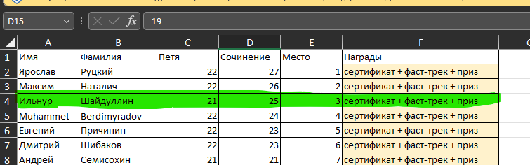

This repo for training devops from Young&&Yandex https://yandex.ru/yaintern/training

Repo with some fixes after 02.12.23 in branch "changesfrom2.12":

- updated secuirity group - egress fix (02.12.23) 
- fixed number of instances in tf vars (real - 2)  (04.12.23)
- removed unused code (04.12.23)

Task - task.docx

Presentation - Presentation.pptx

Made on AWS

If you wanna run locally use all-in-one-update.sh script

Detailed analysis of assignments from the organizers https://habr.com/ru/companies/yandex/articles/789838/

